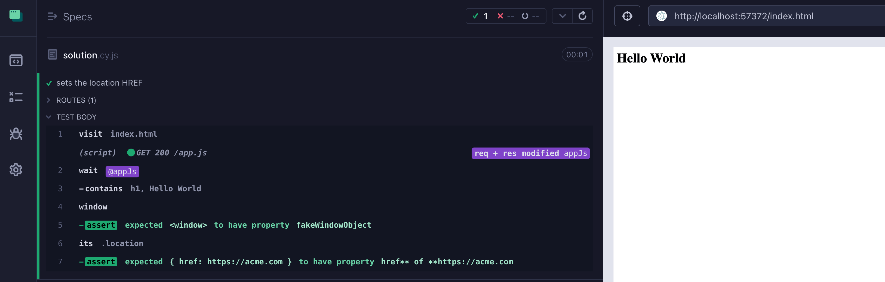

# with-window

> Fake window location object in Cypress tests

Allows testing HREF assignments like `location.href = 'https://acme.com'`

Read the blog post [Mock The Location Href Property](https://glebbahmutov.com/blog/mock-location-href/)
